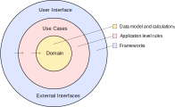
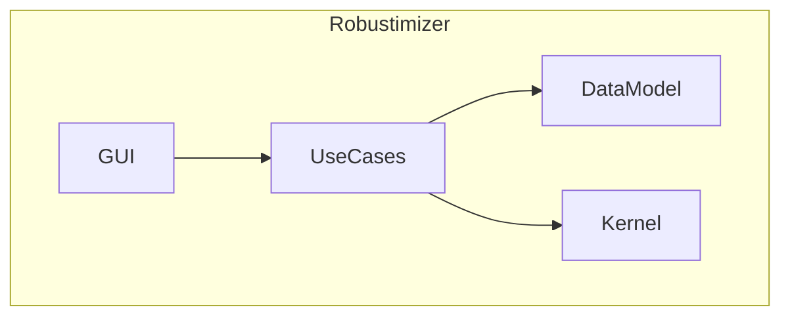
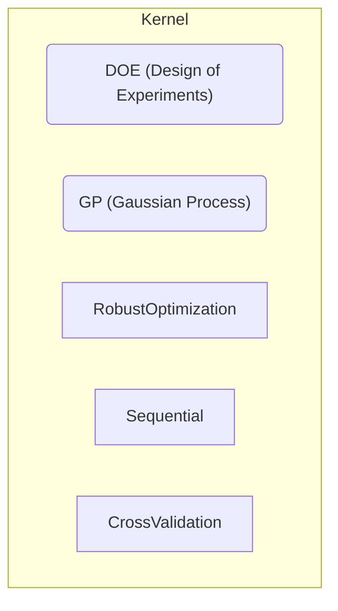
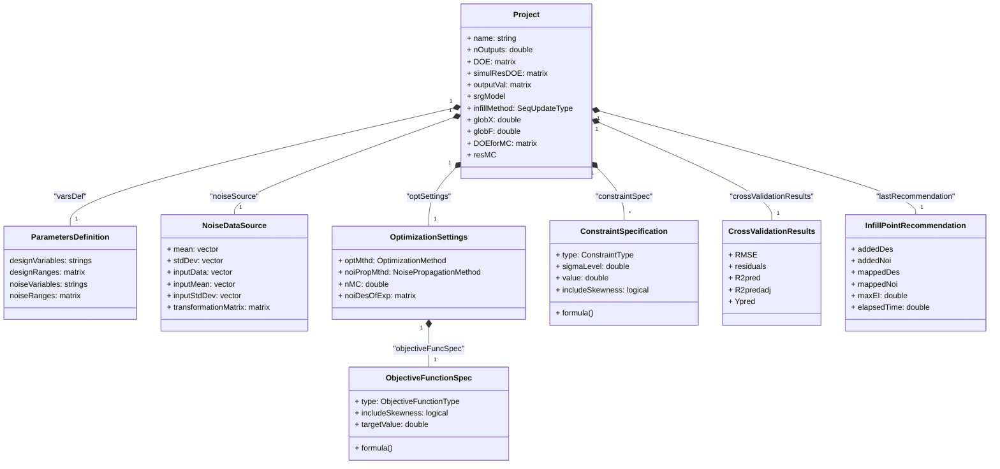
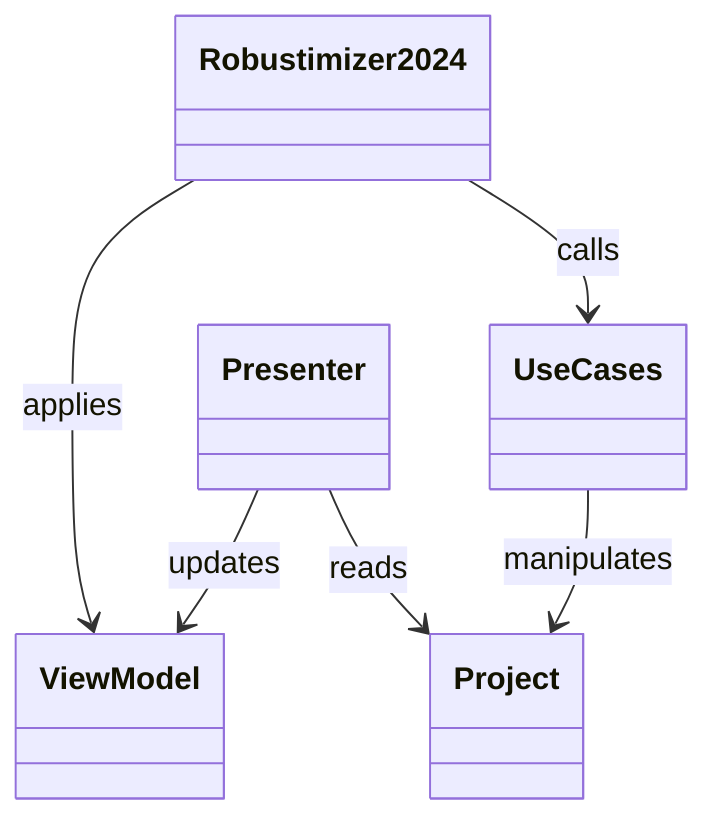

# Application Design

This design document outlines the architecture of the Robustimizer application, which is roughly based on the 'clean architecture' principles [^clean-architecture] introduced by Robert C. Martin. The application is divided into several layers, each with its own responsibilities and dependencies. The layers are designed to be loosely coupled, allowing for flexibility, testability and ease of maintenance.

For the theorethical background of the Robustimizer application, please refer to the [Technical details (Word) document](<./Technical details.docx>).

[TOC]

[^clean-architecture]: See for example [this blog post](https://blog.cleancoder.com/uncle-bob/2012/08/13/the-clean-architecture.html) by Robert C. Martin for an introduction to clean architecture principles. A more detailed explanation can be found in his book "Clean Architecture: A Craftsman's Guide to Software Structure and Design" ([Amazon](https://a.co/d/097QA2xG), [O'Reilly](https://learning.oreilly.com/library/view/clean-architecture-a/9780134494272/)).

## Overview

The Robustimizer application is divided into the layers shown in the following "onion" diagram:

Each layer has a specific role and set of responsibilities:

- **User Interface (UI)**: The UI layer is responsible for presenting information to the user and handling user interactions. The main UI is created using Matlab's App Designer. The UI layer communicates with the use cases layer to perform the necessary operations in response to user input.
- **Use Cases**: The use cases layer contains the application's logic and use cases. It orchestrates the interactions between the data model and the calculations performed in the kernel, as well as providing validation and error handling for the application's functionalities.
- **Domain**: The domain layer contains the data model representing the structure and relationships of the application's data, as well as the 'kernel' calculations and algorithms.

Note that the dependencies between the layers are unidirectional, with each layer depending only on the layers below it. This allows for a clear separation of concerns and makes it easier to test and maintain the application. In particular, the use cases layer is designed to be independent of the UI layer, allowing it to be tested in isolation.

The observant reader might have noticed that the _"interface adapters"_ layer from the original clean architecture diagram is not explicitly shown here. This is intentional, as we use a simplified approach where the UI layer directly interacts with the use cases layer. This layer could be added in the future if needed to handle more complex interactions between the UI and the use cases.

## Directory Structure

The application source code is organized into the following directories inside the **`src`** directory:

- **`DataModel`**: Contains the data model classes representing the structure of the application's data.
- **`UseCases`**: Contains the functions that implement the application's logic and use cases.
- **`GUI`**: Contains the extra source files for the user interface (the _Matlab App Designer_ main app file is located in `src`).
- **`Kernel`**: Contains the core functions that implement the calculations and algorithms used by the application.

Tests for the application are either located near the unit under test in the same directory (for lower-level tests) or in the **`test`** directory in the root of the project (for higher-level tests).

## Components

The directory structure of the application corresponds to the main components:

## DataModel

The data model classes are designed to represent the structure of the application's data. The following class diagram shows the main classes and their relationships.

The `Project` class represents the main data structure of the application, containing the data and settings for a single optimization project. The `use case` functions in the `UseCases` layer operate on instances of the `Project` class to perform the necessary calculations and operations.

Note that an instance of the `Project` class contains members that track 'last' state information:

- `lastRecommendation`:  the results of the last infill point recommendation.
- `crossValidationResults`: the last cross-validation results.
- `globX` and `globF`: the last optimization results.
- `resMC`: the last Monte Carlo analysis results.

## UI Updating

As described in the 'Clean Architecture' book, a `ViewModel` and `Presenter` are used to update the UI. 

The `Presenter` is responsible for updating a `ViewModel` with the data from a `Project` class instance. The `ViewModel` contains properties representing the controls in the UI and can include values to display, controls to enable/disable, visibility, etc. 

Note that the `ViewModel` does not contain any logic, as all UI update logic should be in the `Presenter`. Similarly, the AppDesigner code (`Robustimizer2024.mlapp`) ideally should not contain any logic pertaining to updating controls, a simple application of the `ViewModel` properties should be sufficient.

This approach makes it possible to test the UI updating logic separately from the UI itself (see e.g. `TestPresenter.m`).

> Note that, again, this is a simplified version of the clean architecture. The boundary between the UI and the use cases/project is not as clearly defined as in the original clean architecture, but the separation of concerns is still maintained.
